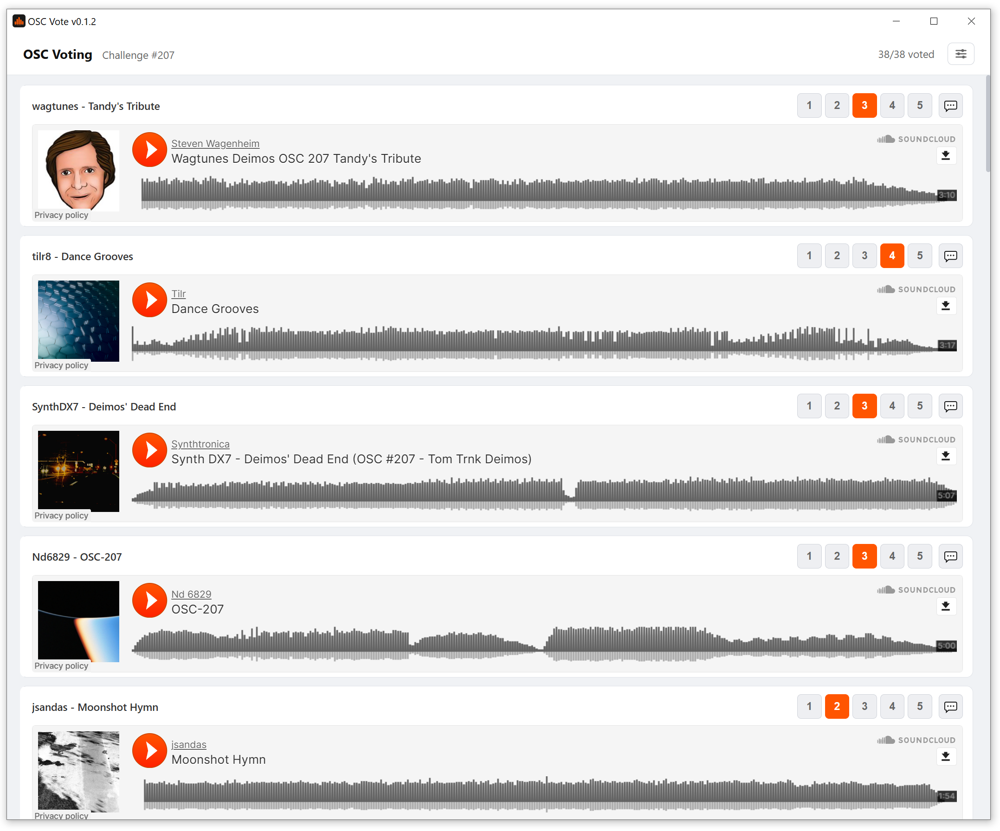

# OSC Vote

> :sparkles: The application is written with use of AI

> :heart: This application uses an API originally developed and maintained by the OSC creators for their own application. All credits and thanks go to the original authors for making this interface available and for their work.

A desktop app for voting in the [One Synth Challenge](https://onesynthchallenge.org) (OSC) organized by [KVR Audio forum](https://www.kvraudio.com/forum/viewforum.php?f=1)

## Features

- **Inline playback** — SoundCloud player embedded per song, no browser switching
- **Auto-advance** — next song starts automatically when the current one ends
- **Vote buttons** — 1–5 points inline; click the active score again to clear the vote
- **Timed comments** — 💬 button opens the SC track in your browser at the exact timestamp you're listening at
- **Auto-scroll** — scrolls to the first unvoted song on load (toggle in options)
- **Persistent session** — stays logged in between launches
- **Auto-login** — saves credentials and logs in automatically on next launch

> Due to SoundCloud limitations, comment has to be added on SC page, thus, comment icon opens it in the browser

> Due to SoundCloud limitations, opened comment page starts the song playbeck. Prace SPACE bar to stop it immediatelly (or mute the browser)



## Download

Get the latest release from the [Releases page](../../releases).

| Platform | File |
|----------|------|
| Windows | `OSC-Vote-vX.X.X-windows-amd64.zip` → extract, run `OSC Vote.exe` |
| macOS | `OSC-Vote-vX.X.X-darwin-universal.zip` → extract, move to Applications |
| Linux | `OSC-Vote-vX.X.X-linux-amd64.zip` → extract, run `OSC-Vote-...` |

## Installing

### Windows
SmartScreen may warn on first launch. Click **More info → Run anyway**.

### macOS
macOS blocks unsigned apps from unknown developers. On first launch:
1. Right-click `OSC Vote.app` → **Open**
2. Click **Open** in the confirmation dialog

### Linux
Install runtime dependencies if the app fails to start:
```bash
sudo apt install libgtk-3-0 libwebkit2gtk-4.0-0
```


## Building from source

**Requirements:**
- [Go 1.21+](https://go.dev/dl/)
- [Node.js 18+ with npm](https://nodejs.org)
- [Wails v2](https://wails.io): `go install github.com/wailsapp/wails/v2/cmd/wails@latest`

```bash
git clone https://github.com/michal-bartak/OSC-Votes.git
cd OSC-Votes
wails build -platform windows/amd64    # or: darwin/universal  linux/amd64
```

Output binary lands in `build/bin/`.

For live development with hot reload:
```bash
wails dev
```
