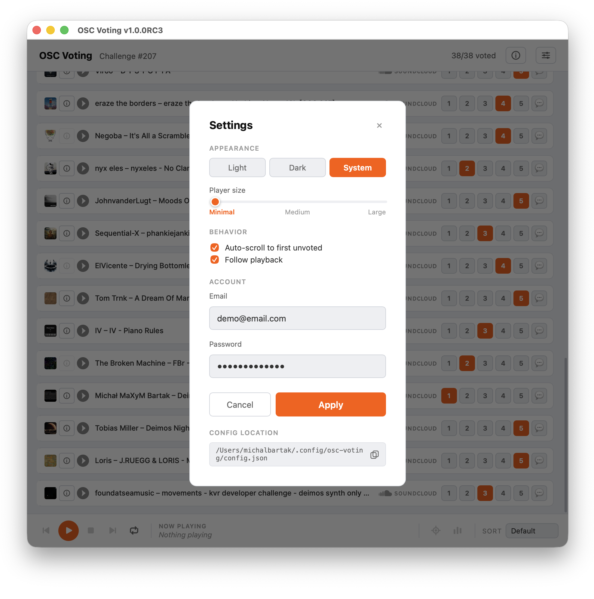
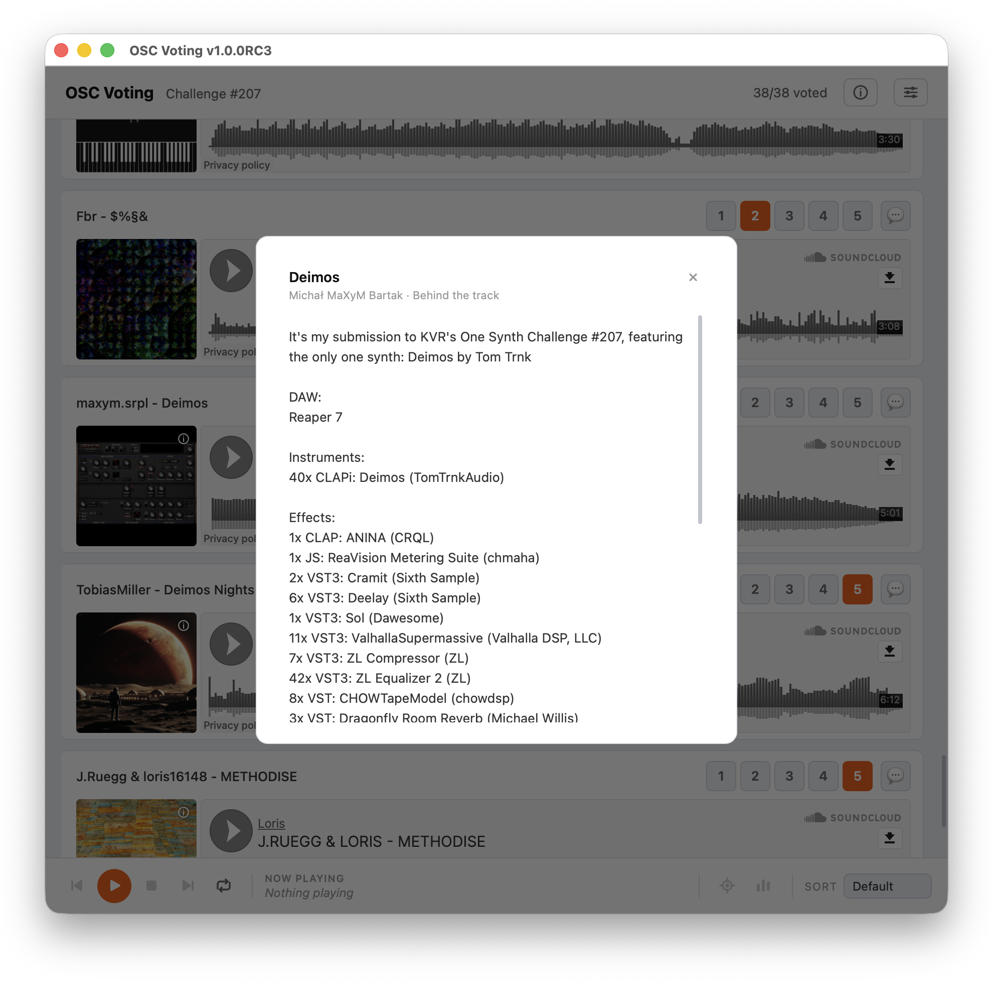

# OSC Voting

A companiond desktop app for voting in the [One Synth Challenge](https://onesynthchallenge.org) (OSC) — a synth music competition hosted on the [KVR Audio forum](https://www.kvraudio.com/forum/viewforum.php?f=1).

> Uses the OSC website's API. Full credit to the OSC creators for building and maintaining the platform.

## Features

The original voting app uses drag-and-drop SoundCloud players to assign votes. While it works well, I found it a bit cumbersome when reviewing larger song lists. This application was created as an alternative workflow, with a focus on:

- **simplified voting**
- **playlist-style playback**
- **easier commenting**




**Additional features:**

- **Comments** — 💬 opens the SoundCloud track page in your browser at the current playback position allowing enter the comment
- **Behind the track** — ⓘ displays the artist's track description (when available) in a popup
- **Playlist playback** — automatically advances to the next song, with options to loop the playlist or the current track
- **Transport controls** — play/pause, stop, previous/next, and loop modes (track / playlist / off)
- **Player size** — choose between Minimal, Medium, and Large layouts
- **Keyboard shortcut** — Space toggles play/pause
- **Follow playback** — automatically scrolls to the currently playing song when advancing through the playlist (optional). You can also jump to the current song at any time.
- **Jump to unvoted** — optionally jumps to the first unvoted song on startup. You can also trigger this manually at any time.
- **Sorting** — by default order, vote score (high/low), or title
- **Auto-login** — saves credentials and restores the session on the next launch
- **Theme** — Dark, Light, or System

> 💡 Comments are posted directly on SoundCloud (its API does not provide comment functionality), so the 💬 button opens the track page in your browser. Note that SoundCloud will begin playing the track automatically - press Space or mute the browser tab if needed.

## Download

Get the latest release from the [Releases page](../../releases).

| Platform | File |
|----------|------|
| Windows | `OSC-Voting-vX.X.X-windows-amd64.zip` → extract, run `OSC-Voting.exe` |
| macOS | `OSC-Voting-vX.X.X-macos-universal.dmg` → open, drag to Applications |
| Linux (Debian/Ubuntu) | `OSC-Voting-vX.X.X-linux-amd64.deb` → `sudo apt install ./OSC-Voting-*.deb` |
| Linux (Fedora/RHEL) | `OSC-Voting-vX.X.X-linux-amd64.rpm` → `sudo dnf install ./OSC-Voting-*.rpm` |

## Installing

### Windows
SmartScreen may warn on first launch. Click **More info → Run anyway**.

### macOS
The app is unsigned, so macOS quarantines it when downloaded via a browser.

**Option 1 — download with curl (recommended):**
```bash
curl -LJO https://github.com/michal-bartak/OSC-Voting/releases/latest/download/OSC-Voting-vX.X.X-macos-universal.dmg
```
Open the `.dmg` normally — no further steps needed.

**Option 2 — already downloaded via browser:**
Open the `.dmg`, drag the app to Applications, then run once in Terminal:
```bash
xattr -d com.apple.quarantine /Applications/OSC-Voting.app
```

### Linux
The packages declare runtime dependencies, so your package manager will pull them in automatically.

```bash
# Debian / Ubuntu
sudo apt install ./OSC-Voting-vX.X.X-linux-amd64.deb

# Fedora / RHEL / openSUSE
sudo dnf install ./OSC-Voting-vX.X.X-linux-amd64.rpm
```

If the app fails to start, install the runtime libraries manually:
```bash
sudo apt install libgtk-3-0 libwebkit2gtk-4.1-0          # Debian/Ubuntu 24.04+
sudo dnf install gtk3 webkit2gtk4.1                       # Fedora 38+
sudo dnf install gtk3 webkit2gtk3                         # Fedora 37 / RHEL 9
```

## Troubleshooting

### Linux — multi-monitor rendering issues on Wayland

On some multi-monitor Wayland setups (e.g. Ubuntu 24.04) the window may open on the wrong display or render incorrectly. The app runs natively on Wayland by default; forcing the GTK backend to X11 (via XWayland) resolves it.

**One-off (terminal):**
```bash
GDK_BACKEND=x11 OSC-Voting
```

**Permanent, per-app — edit the `.desktop` file:**
```bash
sudo nano /usr/share/applications/osc-voting.desktop
```
Change the `Exec=` line from:
```
Exec=OSC-Voting
```
to:
```
Exec=env GDK_BACKEND=x11 OSC-Voting
```
Save and log out/in. The launcher will now always start the app under XWayland while leaving everything else unaffected.

## Building from source

**Requirements:**
- [Go 1.21+](https://go.dev/dl/)
- [Node.js 18+](https://nodejs.org)
- [Wails v2](https://wails.io): `go install github.com/wailsapp/wails/v2/cmd/wails@latest`

**Linux build dependencies:**
```bash
# Debian/Ubuntu 24.04+
sudo apt install libgtk-3-dev libwebkit2gtk-4.1-dev build-essential pkg-config

# Fedora 38+
sudo dnf install gtk3-devel webkit2gtk4.1-devel gcc-c++ pkgconf-pkg-config
```

On older distros shipping only WebKit 4.0 (Ubuntu 22.04, RHEL 9), remove `"build:tags": "webkit2_41"` from `wails.json` and install `libwebkit2gtk-4.0-dev` / `webkit2gtk3-devel` instead.

```bash
git clone https://github.com/michal-bartak/OSC-Voting.git
cd OSC-Voting
make build        # build for the current platform
make dev          # hot-reload dev server
```

Or invoke Wails directly if you prefer:
```bash
wails build -platform linux/amd64   # or: darwin/universal  windows/amd64
wails dev
```

Output lands in `build/bin/`. The Makefile also provides `make build-linux` and `make build-windows` for cross-platform targets, though cross-compilation requires the matching toolchain and is best left to CI.

---

*Built by Michal Bartak, assisted by [Claude](https://claude.ai).*
