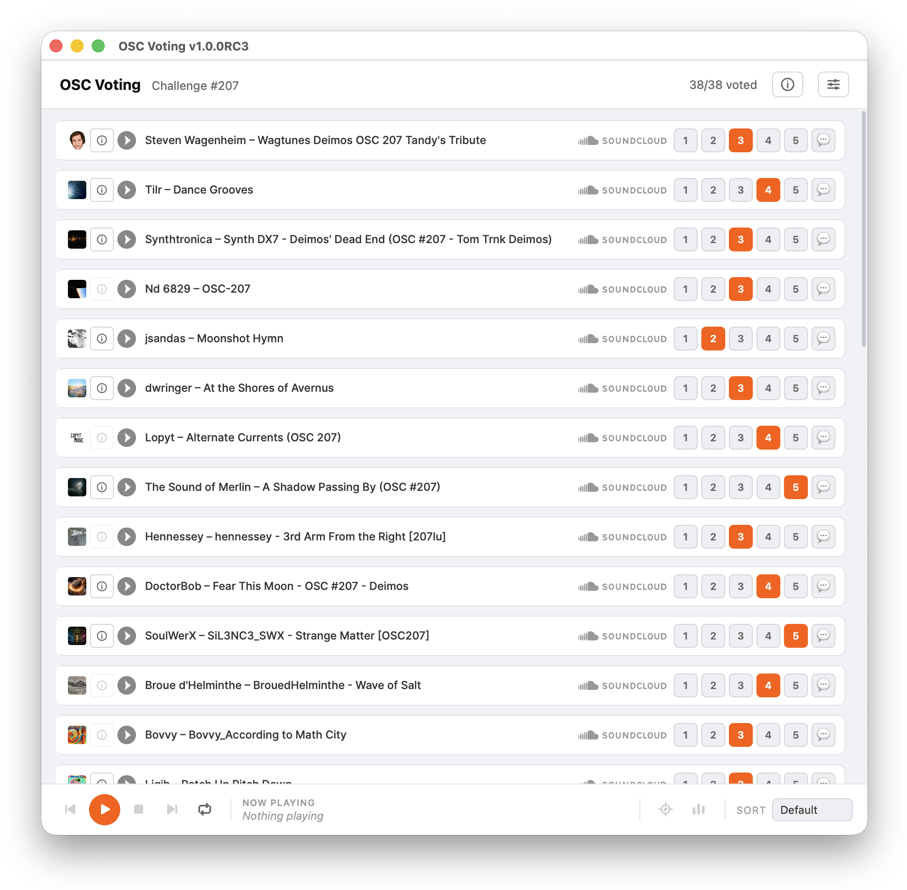
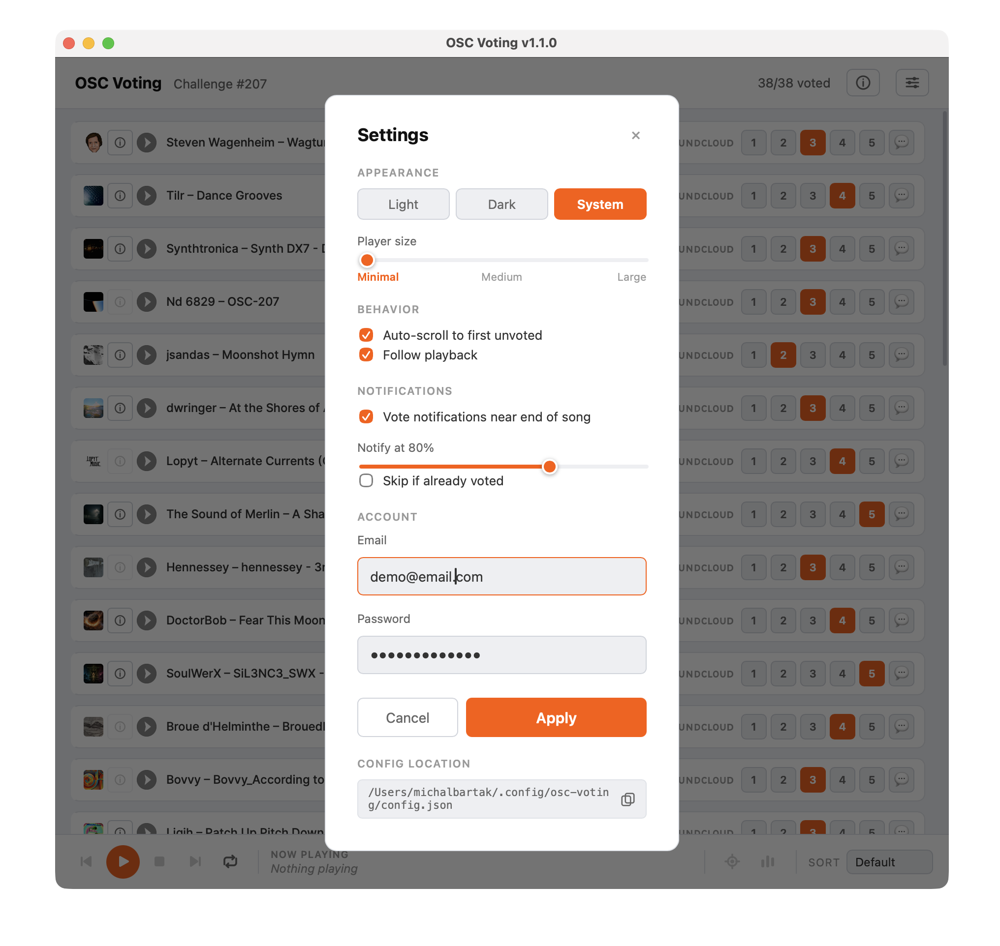
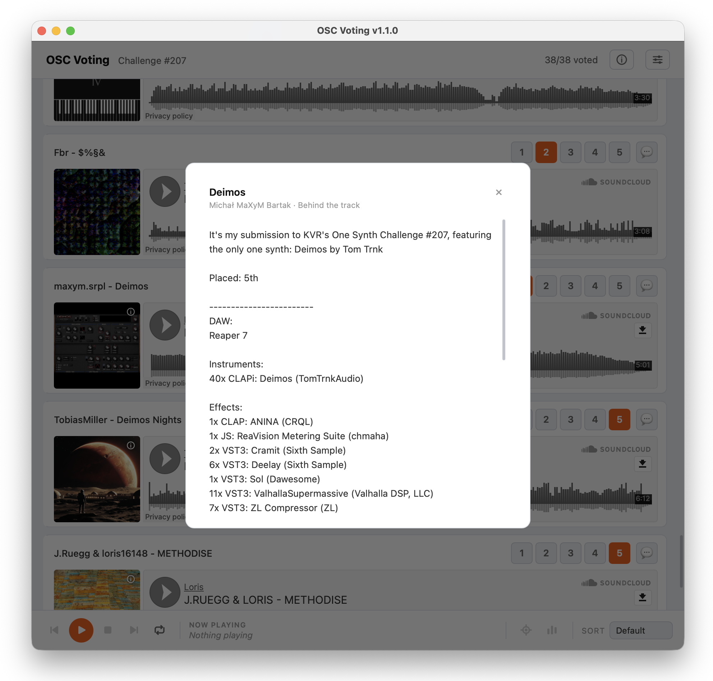

## Overview

A companion desktop app for voting in the [One Synth Challenge](https://onesynthchallenge.org) (OSC) — a synth music competition hosted on the [KVR Audio forum](https://www.kvraudio.com/forum/viewforum.php?f=1).

> Uses the OSC website's API. Full credit to the OSC creators for building and maintaining the platform.

The original voting app uses drag-and-drop SoundCloud players to assign votes. This app offers an alternative workflow focused on simplified voting, playlist-style playback, and easier commenting.

## Features

| Feature | Description |
|---------|-------------|
| **Voting** | Click vote buttons (1–5) per track; votes are saved immediately |
| **Playback** | Playlist-style with auto-advance, loop (track / playlist / off), and transport controls |
| **Comments** | 💬 opens the SoundCloud track page in your browser at the current playback position |
| **Behind the track** | ⓘ shows the artist's track description in a popup (when available) |
| **Player size** | Minimal, Medium, or Large layout |
| **Keyboard shortcut** | Space toggles play/pause |
| **Follow playback** | Auto-scrolls to the playing song on advance; manual jump also available |
| **Jump to unvoted** | Optionally jumps to the first unvoted song on startup; also triggerable manually |
| **Sorting** | Default order, vote score (high/low), or title |
| **Auto-login** | Saves credentials and restores the session on next launch |
| **Theme** | Dark, Light, or System |
| **Persistent window size** | Window dimensions are saved and restored on restart |

:::note
Comments are posted directly on SoundCloud (its API does not provide comment functionality), so the 💬 button opens the track page in your browser. SoundCloud will begin playing the track automatically — press Space or mute the browser tab if needed.
:::

 
